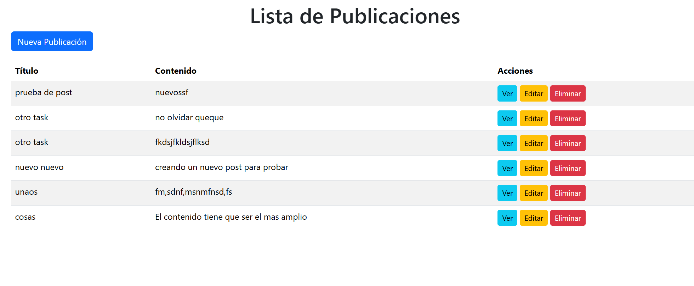

# **Día 1: Inicio de Proyecto Rails**

### **1. Inicio del proyecto**
Creamos un nuevo proyecto Rails vinculado con la base de datos PostgreSQL:
```bash
rails new proyecto --database=postgresql
```
> **Nota**: El parámetro `--database=postgresql` asegura que Rails configure PostgreSQL como base de datos en lugar de SQLite.

---

### **2. Configuración de la base de datos**
1. Modificamos el archivo `config/database.yml` para incluir las credenciales correctas de PostgreSQL:
   ```yaml
   development:
     <<: *default
     database: proyecto_development
     username: postgres
     password: tu_contraseña
     host: localhost
     port: 5432
   ```

2. Creamos las bases de datos requeridas con:
   ```bash
   rails db:create
   ```
   Esto genera las bases de datos `proyecto_development` y `proyecto_test`.

---

### **3. Incorporación de Bootstrap**
Para estilizar la aplicación, integramos Bootstrap:
1. Agregamos las gemas necesarias al `Gemfile`:
   ```ruby
   gem 'bootstrap', '~> 5.3.0'
   gem 'sassc-rails'
   ```
2. Instalamos las dependencias con:
   ```bash
   bundle install
   ```

3. Configuramos los assets:
   - Renombramos `app/assets/stylesheets/application.css` a `application.scss`.
   - Incluimos Bootstrap en el archivo:
     ```scss
     @import "bootstrap";
     ```

4. Configuramos JavaScript en `app/javascript/application.js`:
   ```javascript
   import "bootstrap";
   import "@popperjs/core";
   ```

---

### **4. Generación de CRUD con Scaffold**
Creamos un CRUD para el recurso `Post`:
```bash
rails generate scaffold Post title:string body:text
```
> **Nota**: Este comando genera el modelo, controlador, vistas y rutas necesarias para manejar publicaciones.

---

### **5. Migraciones y vistas**
1. Aplicamos las migraciones para crear la tabla `posts`:
   ```bash
   rails db:migrate
   ```

2. Personalizamos las vistas generadas en `app/views/posts/`:
   - Agregamos clases de Bootstrap a los formularios y botones en `app/views/posts/_form.html.erb`.

---

### **6. Iniciar el servidor**
Para verificar que todo funcione correctamente, iniciamos el servidor:
```bash
rails server
```
Accedemos a la aplicación en [http://localhost:3000/posts](http://localhost:3000/posts).

---

### **Comandos útiles**
- Crear un nuevo proyecto:
  ```bash
  rails new proyecto --database=postgresql
  ```
- Crear bases de datos:
  ```bash
  rails db:create
  ```
- Generar un scaffold:
  ```bash
  rails generate scaffold Recurso campo1:tipo campo2:tipo
  ```
- Aplicar migraciones:
  ```bash
  rails db:migrate
  ```
- Iniciar el servidor:
  ```bash
  rails server
  ```
- Instalar gemas:
  ```bash
  bundle install
  ```

---
## Captura de pantalla

